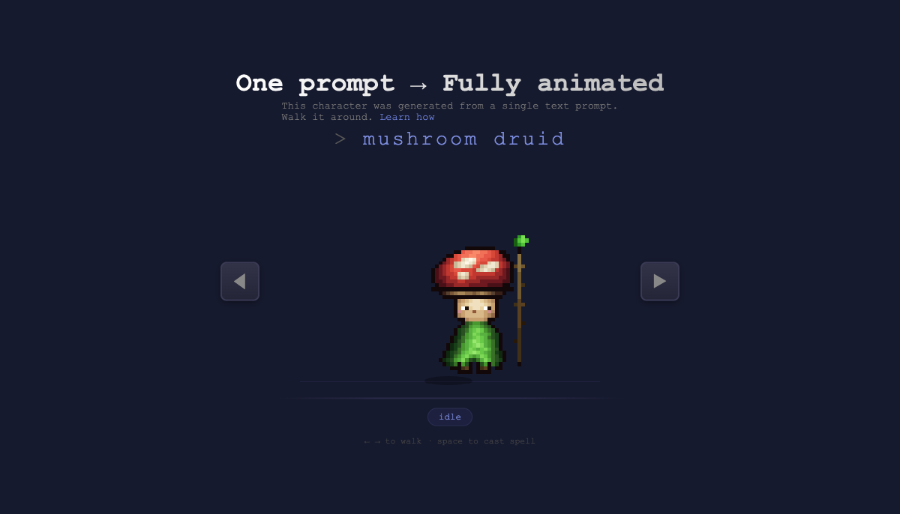
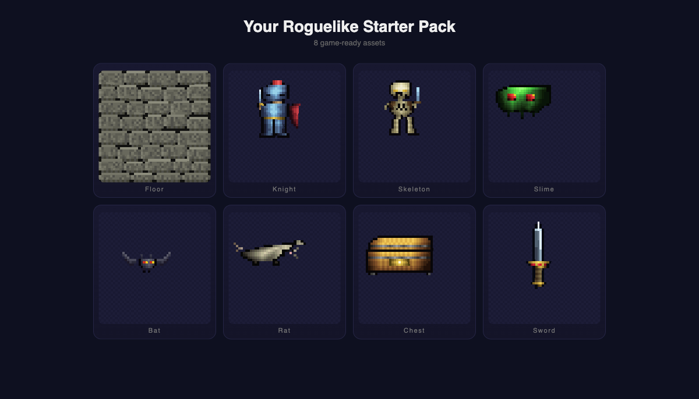

<div align="center">

# Pixel Art Skill

**Skill para Claude Code que gera personagens e assets de pixel art animados — direto no terminal.**

[](https://claude.ai/code)
[](https://developer.mozilla.org/en-US/docs/Web/API/Canvas_API)
[](https://developer.mozilla.org/en-US/docs/Web/JavaScript)
[](#license)

[Features](#-features) · [Como Funciona](#-como-funciona) · [Exemplos](#-exemplos) · [Instalacao](#-instalacao) · [Tecnicas](#-tecnicas)

<br/>



<br/>

</div>

---

## O que e o Pixel Art Skill?

Uma skill para **Claude Code** que ensina o Claude a gerar personagens e assets de pixel art animados em HTML5 Canvas. Basta descrever o personagem que voce quer e o Claude cria um arquivo HTML interativo com:

- Sprite desenhado **pixel a pixel** com paleta hue-shifted
- **Animacoes**: idle (respiracao + piscar), walk cycle, attack
- **Controles**: teclado e touch
- **Efeitos**: particulas, sombra, ground anchoring

**Nenhuma API externa necessaria.** Tudo roda local no navegador.

---

## Features

| Feature | Descricao |
|---|---|
| **Buffer Canvas** | Sprites desenhados a 1:1 num canvas offscreen e escalados com `image-rendering: pixelated` — pixels perfeitos |
| **Paleta Hue-Shifted** | 5-8 tons por material. Sombras deslocam para frio (azul/roxo), highlights para quente (amarelo/laranja) |
| **Body Parts Modulares** | Cap, face, cloak, staff, feet — cada parte com funcao separada para animacao independente |
| **Grounding** | Pes ancorados no chao. Apenas o corpo faz bob/bounce — o personagem nunca flutua |
| **Walk Cycle** | 4 frames com body bounce e foot separation. Cloak sway sincronizado com os passos |
| **Idle Breathing** | Bob de 1px + piscar aleatorio com intervalos naturais |
| **Direction Flip** | `scale(-1,1)` com offset correto para sombra, particulas e efeitos |
| **Particulas** | Sistema de particulas com alpha fade, upward drift, cores da paleta |
| **Attack Spell** | Efeito de magia com glow radial e particulas verdes |
| **Asset Packs** | Gera packs de assets com multiple sprites animados (knight, slime, bat, etc.) |
| **AI Tools Guide** | Instrucoes para integrar PixelLab/SpriteCook via MCP para sprites de producao |

---

## Exemplos

### Mushroom Druid — Personagem Interativo

Personagem completo com idle, walk e attack. Gerado a partir de um unico prompt.

<div align="center">

</div>

> **Prompt usado**: *"Cria um personagem pixel art mushroom druid com animacao de idle, walk e attack"*

### Roguelike Starter Pack — 8 Assets Animados

Pack completo com Floor, Knight, Skeleton, Slime, Bat, Rat, Chest e Sword.

<div align="center">

</div>

> **Prompt usado**: *"Cria 8 assets de pixel art para um roguelike starter pack"*

---

## Como Funciona

```
Voce: "Cria um mushroom druid pixel art animado"
              |
              v
   Claude Code + Skill
              |
              v
   +--------------------------+
   | 1. Cria buffer canvas    |
   |    56x64 offscreen       |
   |                          |
   | 2. Define paleta         |
   |    hue-shifted (40 cores)|
   |                          |
   | 3. Desenha body parts    |
   |    hLine() row-by-row    |
   |                          |
   | 4. Monta animacoes       |
   |    idle/walk/attack      |
   |                          |
   | 5. Adiciona controles    |
   |    keyboard + touch      |
   +--------------------------+
              |
              v
   mushroom-druid.html
   (abre no navegador, 100% local)
```

### Anatomia do Sprite

```
  ┌──────────────────┐
  │   Mushroom Cap    │  ← drawCap(ox, oy)     — 14 rows, dome shape
  │  ○ ○  spots  ○   │     8 tons de vermelho hue-shifted
  ├──────────────────┤
  │      Brim         │  ← 2 rows, brown tones
  ├──────────────────┤
  │     Face          │  ← drawFace(ox, oy, blink)
  │   ◉   ◉  eyes    │     olhos com shine, blush, boca
  │    ‿  mouth       │
  ├──────────────────┤
  │    Cloak          │  ← drawCloak(ox, oy, sway)
  │   /leaf\          │     9 tons de verde, leaf edges
  │  / folds \        │     sway acompanha walk
  ├──────────────────┤
  │   Staff           │  ← drawStaff(ox, oy)
  │     |  🌿         │     madeira com knots + folha no topo
  ├──────────────────┤
  │   Feet            │  ← drawFeet(ox, feetY, walkStep)
  │   ▪  ▪            │     Y FIXO — nunca flutua
  └──────────────────┘
```

---

## Instalacao

### Como Skill (copiar para seu projeto)

```bash
# Copie o arquivo da skill para seu projeto
cp pixel-art-character.md seu-projeto/.claude/skills/
```

### Como Skill Global (todos os projetos)

```bash
# Copie para a pasta global de skills do Claude Code
cp pixel-art-character.md ~/.claude/skills/
```

Depois, basta pedir ao Claude Code:

```
> Cria um personagem pixel art de um cavaleiro medieval com animacao
```

---

## Tecnicas

### Buffer Canvas (o segredo dos pixels crispy)

```javascript
// Buffer offscreen na resolucao real do sprite
const buf = document.createElement('canvas');
buf.width = 56; buf.height = 64;
const bc = buf.getContext('2d');

// Display com escala e SEM smoothing
const dctx = display.getContext('2d');
dctx.imageSmoothingEnabled = false;
dctx.drawImage(buf, x, y, 56 * 5, 64 * 5);
```

### Paleta Hue-Shifted

```
Sombra ←───── Base ─────→ Highlight
#4a1018       #c03830       #f88868
(purple)      (red)         (orange)
  frio                        quente
```

### Grounding

```javascript
// CORRETO: pes fixos, corpo bob
const baseY = 6 + bob;        // corpo sobe/desce
const feetY = 6 + 32;         // pes FIXOS

// ERRADO: tudo bob junto → personagem flutua
const baseY = 6 + bob;
const feetY = baseY + 32;     // pes flutuam junto!
```

---

## Estrutura

```
pixel-art-skill/
  pixel-art-character.md     # A skill — copie para .claude/skills/
  README.md
  assets/
    mushroom-druid.png       # Screenshot do demo
    roguelike-pack.png       # Screenshot do asset pack
  examples/
    mushroom-druid.html      # Demo interativo completo
    roguelike-pack.html      # 8 assets animados
```

---

## Limitacoes

- **Qualidade**: sprites code-only ficam no estilo chibi/estilizado (~40-56px). Para qualidade de producao (texturas detalhadas, fur, ambientes), use IA como PixelLab ou SpriteCook
- **Resolucao**: melhor resultado em 32x32 a 56x64 pixels. Acima disso o trabalho manual por pixel explode
- **Complexidade**: personagens simples ficam otimos. Cenas complexas com multiplos assets sao possiveis mas trabalhosas

A skill inclui guia para integrar **PixelLab** e **SpriteCook** via MCP quando precisar de qualidade de producao.

---

## License

MIT License - use livremente.
